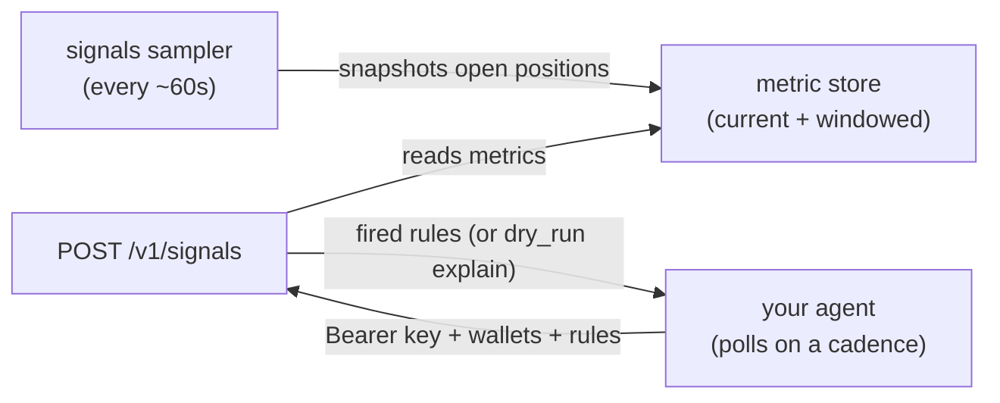

# Signals

YummyBait lets you subscribe **your own agent** to position signals:
the same per-position metrics that drive the bot's `/advice` LLM
payload, evaluated against rules you define. No Telegram round-trip.

!!! tip "Reference agent"

    Don't want to build a consumer from scratch? A complete working
    example — Claude Code as the agent, with the polling loop, CEL
    rules, and agent config (`CLAUDE.md`, skills, `STRATEGY.md`) ready
    to fork — is public at
    [`Yummybait-fin/cdp-wallet-agent-example`](https://github.com/Yummybait-fin/cdp-wallet-agent-example).
    It also wires a
    [Coinbase CDP wallet](https://docs.cdp.coinbase.com/wallets/non-custodial-wallets/overview)
    — a non-custodial wallet your agent can spend from under revocable
    permissions — for optional on-chain actions (collect, rebalance,
    exit), guarded by a server-side
    [wallet policy](https://docs.cdp.coinbase.com/wallets/security-and-policies/policy-engine/overview).
    New to CDP? Start with those two pages before forking the example.

## Pull-based, not push

Signals are delivered **pull-based**. You don't register a callback URL;
nothing is pushed to you. Instead, your agent **polls** a single
endpoint on a cadence of your choosing:

```
POST /v1/signals
```

Each request carries:

- A **Bearer key** identifying you (`ybt_live_…`).
- The **wallets** whose positions you want evaluated.
- Your **rules** — a list of [CEL](https://github.com/google/cel-spec)
  conditions over the [Metrics Catalog](../reference/metrics-catalog.md),
  each with optional `for:`/`cooldown:` firing semantics.

The API evaluates your rules against the latest per-position metrics and
returns the rules that **fired** since your last poll. A `?dry_run=1`
flag explains every rule without firing, so you can debug expressions
before relying on them.

Why pull:

- **You own the schedule and the rules.** Change a threshold by editing
  your next request body — no subscription to manage server-side.
- **No inbound endpoint to operate.** Your agent doesn't need a public
  URL, TLS, or signature verification.
- **The serving path has no hard database dependency.** Requests are
  served from an in-memory metric store, so polling stays fast and
  resilient.

## How it works



1. A sampler snapshots every open position roughly once a minute and
   writes current + windowed metrics to the store.
2. Your agent polls `POST /v1/signals` with its key, wallets, and rules.
3. The API resolves your wallets to positions, evaluates each rule
   against each position's metrics, applies `for:`/`cooldown:`, and
   returns the fires plus an advanced `cursor`.
4. You pass that `cursor` back on the next poll to continue where you
   left off.

## Read next

- [Polling](polling.md) — authentication, the request loop, and writing
  rules.
- [Reference agent example](https://github.com/Yummybait-fin/cdp-wallet-agent-example)
  — a forkable Claude Code agent config that consumes this API.
- [Payload Schema](payload.md) — exact request and response shapes.
- [Versioning](versioning.md) — how the metric schema evolves.
- [Push delivery](webhooks.md) — a planned future option for callback
  (webhook) delivery, for integrators who'd rather receive than poll.
